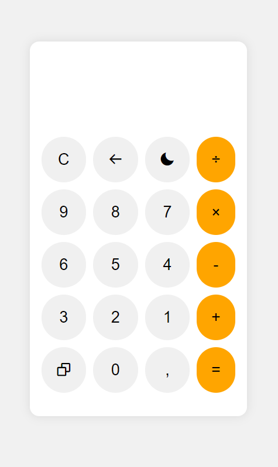
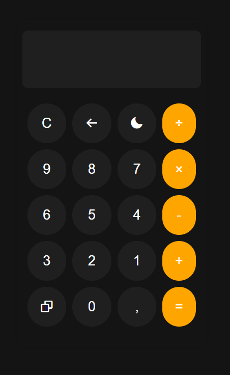

# Calculadora usando React 🔢

Uma calculadora simples implementada com React.

## Funcionalidades 📝

- Realizar cálculos matemáticos básicos.
- Alternar entre o modo claro e escuro.
- Copiar o resultado para a área de transferência.

## Como usar 🔧

1. Utilize os botões digitais ou o teclado para realizar os cálculos númericos.
2. Clique no botão "Calcular" ou pressione Enter para obter o resultado.
3. Clique no botão "🌙" para alternar entre o modo claro e escuro.
4. Clique no botão "📋" para copiar o resultado para a área de transferência.

## Screenshots do projeto 📸

    
    

# Introdução ao Create React App

Este projeto foi inicializado com [Create React App](https://github.com/facebook/create-react-app).

## Available Scripts

No diretório do projeto, você pode executar:

### `npm start`

Executa o aplicativo no modo de desenvolvimento.\
Abra [http://localhost:3000](http://localhost:3000) para visualizá-lo em seu navegador.

A página será recarregada quando você fizer alterações.\
Você também pode ver erros de lint no console.

### `npm test`

Inicia o executor de teste no modo de observação interativo.\
Veja a seção sobre [running tests](https://facebook.github.io/create-react-app/docs/running-tests) para mais detalhes.

## Learn More

[Create React App documentation](https://facebook.github.io/create-react-app/docs/getting-started).

Para aprender React, confira o [React documentation](https://reactjs.org/).